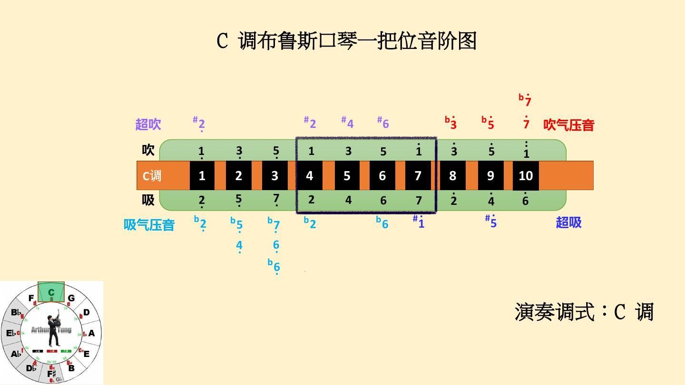
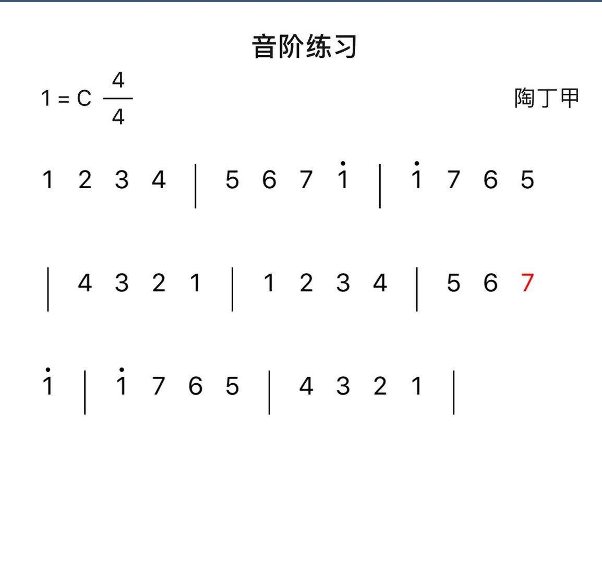

### Lesson 1

-   我是陶丁甲  
    -   陶老师好，很喜欢你吹的曲，想跟你学学[微信红包]
-   好的，收到了哈啊，谢谢你的信任啊，现在有十孔口琴了吗？
    -   我有一个 sp20 的 c
-   好的，这个可以的  
    -   好的，谢谢老师，咱们是怎么学习的？
-   对，咱马上就可以开始了哈。  
    
-   [清晰的单音 mp4](./d83d1977440f047324f8aa14f0f332a0.mp4)
-   [60 速度音节练习](./60速度音节练习.mp3)
-   [布鲁斯口琴入门课程（十节）.xlsx](./布鲁斯口琴入门课程（十节）.xlsx)
-   咱们的模式呢，是一对一的哈，比如说有拍好的云图片，是麦兜练习工作，每一步都是，比如说告诉你该练什么呢，你就重心是这些练完了，下一步一步一步的啊，到你学会为止，这只是初步的，往后还有越来越多的东西负责到底。
-   唯一就是支持支持我的视频，支持我，我们慢慢的交朋友，慢慢的学习口琴啊。
-   第一步四到七孔，每个孔能吹能吸，八个音哈，12345671，把这几个清晰的单音先吹出来哈，清晰的单音。
-   非常好注意两点，第一点是气流的位置在肚脐儿上面，吹气哈气感受感受在肚脐上面点的位置，第二点，注意口型哈，下巴向下拉一点嘴里有点儿空间啊，就是那种嘴里像含了个球一样的感觉，这是口形啊，注意这两点。
    -   好的
-   感觉可以了之后下载一个节拍器，我教你怎么使用节拍器，这就是第一个作业，马上就来了。
-   下载一个节拍器
-   手机 app 上
-   免费的就可以，把速度调到 60
    -   好的
-   他会这么打啊，1234 你吹的时候一定要注意：1234 中间无缝啊，一定要稳定，这两点要注意喽。
-   这就是练习的一个原则要记住：吹奏我们现在的目标呢，就是稳定平稳，还有节拍卡的准确，这两点是我们练习的一个最重要的点哈，以后不管是哪个音阶这是最基本的方法你学会了这个方法以后你找到任何的音节你都 60 的速度 4-4 拍你也不用说打太快了，没关系，音阶就可以这么练，心里唱的这个音，把它练熟了。
-   
    -   好的辛苦老师

### 提交作业

-   [八脚第一课作业](./八脚第一课作业.m4a)

