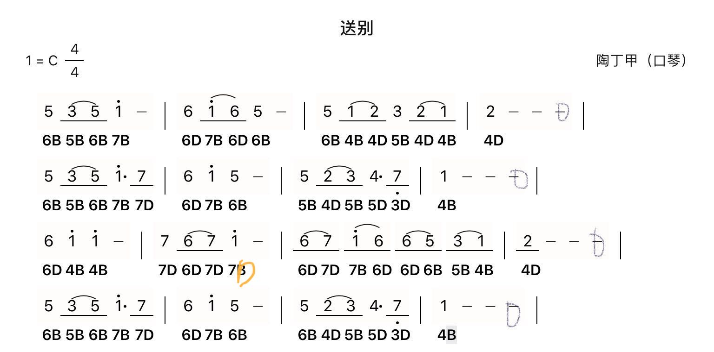

### lesson2
-   我听了单音特别的好哈，就是往上行的时候中间那几个音，有的时候有点儿略赶了一点点啊，就是注意哈，1234，这听着这个点儿感受啊，就这个经过一段时间的适应你会整个的节拍的越来越好。我觉得可以通过！
-   [c调 送别 吉他伴奏.mp3](./c调%20送别%20吉他伴奏.mp3)
-   [送别示范.mp3](./送别示范.mp3)
-   
-   下一步呢，是《送别》，可以先看着简谱把它顺下来，完了再跟着示范去吹奏，再跟着伴奏，我可以给你听听细节哈。